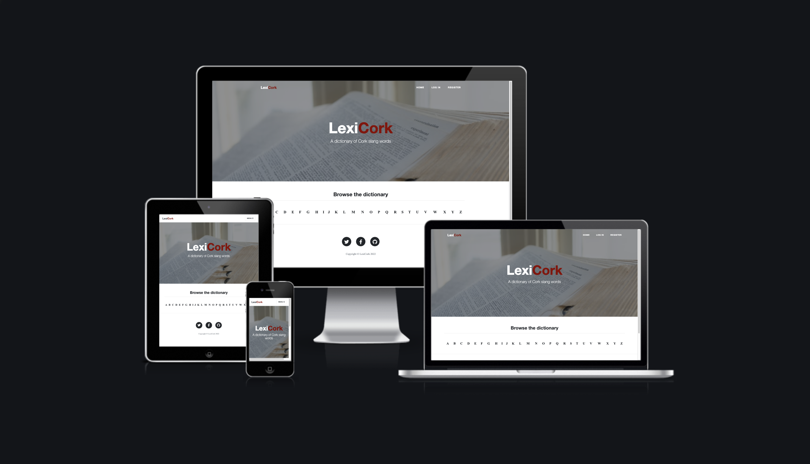
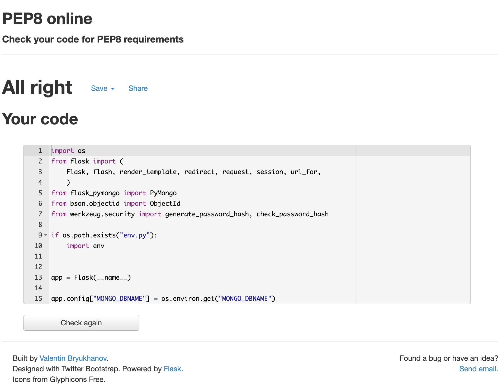

# LexiCork

I created this website for the 3rd Milestone Project on Data Centric Development, at Code Institute's Diploma in Software Development course. 

Visit the live [website.](https://lexicork.herokuapp.com/)

This website is a dictionary of the colloquial language in Co. Cork, Ireland. The name is a portmanteau of the word 'lexicon', which is another word for dictionary and the word 'Cork' replacing the end for a play on words that *hopefully* gives an idea of what the website is about.

# Table of Contents
  * [UX and UI](#ux-and-ui)
    * [Project Research](#project-research)
        + [Research Analysis](#research-analysis)
    * [Persona and Their Goals](#persona-and-their-goals)
    * [Owner Goals](#owner-goals)
    * [User Stories](#user-stories)
    * [Wireframes](#wireframes)
  * [Design](#design)
    * [Colour Scheme](#colour-scheme)
    * [Favicon](#favicon)
    * [Typography](#typography)
    * [Layout](#layout)
  * [Features](#features)
    * [Existing Features](#existing-features)
    * [Features to be Implemented in Future](#features-to-be-implemented-in-future)
  * [Technologies Used](#technologies-used)
    * [Languages](#languages)
    * [Frameworks and Libraries](#frameworks-and-libraries)
  * [Testing](#testing)
    * [Manual Testing](#manual-testing)
    * [Additional Testing](#additional-testing)
    * [Resolved Bugs](#resolved-bugs)
  * [Deployment](#deployment)
  * [Credits](#credits)
    * [Imagery](#imagery)
    * [Code](#code)
    * [Acknowledgements](#acknowledgements)

<small><i><a href='http://ecotrust-canada.github.io/markdown-toc/'>Table of contents generated with markdown-toc</a></i></small>

# UX and UI

  * ## Project Research

    Slang words from other countries or dialects are really popular nowadays. There are entire accounts on social media dedicted to this.

    * ## Research Analysis

      I created this website in order to allow people a place to access the many words of my own home county.

  * ## Persona and Their Goals

    * The ideal visitor to this website is someone who loves words and their meanings.

    * They are looking for a website that allows them to find new words easily. 
    
    * They are looking to return to the site and revisit their favourite words.

    * They want to be able to share the words they find easily.

  * ## Owner Goals
    1. Increase traffic to the site.
    2. Keep existing visitors interested.
  * ## User Stories
    1. As a user visiting the site for the first time, I want to navigate the site intuitively.
    2. As a user, I want to know what information this site provides.
    3. As a user, I want to be able to see an alphabetical list of words to explore.
    4. As a user, I want to be able to create an account to add words and keep track of them.
    5. As a user, I want to find something with a bit of humour.
    6. As a user, I want to be able to access your social media accounts.
  * ## Wireframes
    * Wireframe available [here.](static/img/readme/LexiCork.pdf)
  * ## Design
    * ## Colour Scheme
      I wanted to keep the palette for this website simple. I chose the colour for the font to reflect the county colours of Cork, white and red - blood and bandages.
      
      I chose a background image of an open dictionary to help give the user an idea of the websites function from the outset. It blends seemlessly into the background with an opaque overlay. 
    * ## Favicon 
      I used the [Favicon.io](https://favicon.io/) website to create a favicon for my website.
    * ## Typography
      I wanted a simple font for the website Open sans fit perfectly.
    * ## Layout
      I decided on a multi-page website because I felt like each section deserved it's own dedicated page. The alphabet appears on the landing page, which links to the a page for each letter, along with a random word generator. The alphabet pages feature any words beginning with that letter. Login and register allow you to login and register respectively. The profile page contains all the words a particular user has created. Submit word allows a logged in user to add a *new* word. Logged in users can edit and delete their own words. Logout pops the user session and redirects to the login page.
  * ## Features
    * ## Existing Features
      * The website has the following features :
        * Navbar - Appears on all pages. Contains links to Home, Login, Register, additionally, Profile, Submit Word, and Logout if a user is logged in.

        * Content - The alphabet appears on the landing page, along with a random word generator. The alphabet pages feature any words beginning with that letter. Login and register allow you to login and register respectively. The profile page contains all the words a particular user has created. Submit word allows a logged in user to add a *new* word. Logged in users can edit and delete their own words. Logout pops the user session and redirects to the login page.

        * Footer - The footer contains the website name and some external links. 

    * ## Features to be Implemented in Future
      * Ability to share words
      * Ability to rate words
      * Ability to view and sort words alternatively
  * ## Technologies Used
    * ## Languages
      * [HTML5](https://en.wikipedia.org/wiki/HTML5)
      * [CSS](https://en.wikipedia.org/wiki/CSS)
      * [Python](https://en.wikipedia.org/wiki/Python_(programming_language))
    * ## Frameworks and Libraries
      * [Bootstrap](https://getbootstrap.com/docs/5.0/getting-started/introduction/)
      * [Start Bootstrap](https://startbootstrap.com/)
      * [Google Fonts](https://fonts.google.com/)
      * [Font Awesome](https://fontawesome.com/)
      * [Favicon.io](https://favicon.io)
      * [Balsamiq](https://balsamiq.com/)
      * [VS Code](https://code.visualstudio.com/)
      * [GitHub](https://github.com/)
      * [Heroku](https://heroku.com/)
      * [Am I Responsive](http://ami.responsivedesign.is/)
  * ## Testing
    Testing for this website was done using the Google Chrome Browser, using Chrome Developer Tools to check the different screensizes. Testing was also done on an iPhone 8 using Safari, as sometimes Safari can cause issues with how the website renders. No such errors were found.
    * ## User Stories Testing
      1. As a user visiting the site for the first time, I want to navigate the site intuitively.
         * A user can navigate around the site with ease. All components work as they should.
      2. As a user, I want to know what information this site provides.
         * A user can immediately see that this site is a dictionary for slang words.
      3. As a user, I want to be able to see an alphabetical list of words to explore.
         * A user can view the alphabet on the home page and navigate to one of the letters in order to see what words are associated with it.
      4. As a user, I want to be able to create an account to add words and keep track of them.
         * A user can register for an account, login to their account and navigate to their profile page where they can view all words they have created.
      5. As a user, I want to find something with a bit of humour.
         * A user can find a bit of humour in the content of the slang words on this site.
      5. As a user, I want to be able to access your social media accounts.
         * A user can find the links to the owners social media accounts in the footer.
    * ## Manual Testing 
      * Navbar & Footer
        * All links in navbar work as expected. All links to letter pages work as expected. The random word geerator works on page reload or by hitting the 'New Word' button. Links in the footer open as expected in a new tab.      
      * Home
        * All links to letter pages work as expected. The random word geerator works on page reload or by hitting the 'New Word' button.
      * Profile
        * Headed with the users Profile name. Contains all the words a user has created, with the option to edit and delete them. If they have not created any words there is a simple message to ask them if they would like to add one and redirects the user to the 'Submit Word' page.
      * Register
        * Allows a user to register as expected.
      * Login
        * Allows a user to login as expected.
      * Logout
        * Allows a user to logout as expected.
      * Submit Word
        * Allows the user to add a word as expected.
      * Edit Word
        * Allows the user to edit a word, and replace the original with no duplicate. There is a minor bug that I haven't yet solved. The letter category selector always shows the letter 'A' as the letter which the word belongs to, even if it has been assigned a different letter. The words appear under the correct letter on the individual alphabet pages. It is just on the 'Edit Word' page where this error occurs.
      * Delete Word
        * Allows the user to delete a word as expected.
    * ## Additional Testing 
      * [W3C - Jigsaw Validator](https://jigsaw.w3.org/css-validator/)

      * [W3C - NU HTML Checker](https://validator.w3.org/nu/)

      * [PEP8 - Online Checker](http://pep8online.com/)

        

    * ## Resolved Bugs
      * Users that weren't logged in could access pages that were supposed to be hidden unless logged in. Fixed this using if statement to verify the user was in session.
      * In order to improve accessibility, I added *aria-hidden true* to Font Awesome icons that were not functional.

  * ## Deployment
      This project used GitPod for developement, GitHub to storage the repository, Git for version control and deployed using Heroku.

      Forking the GitHub Repository
      The repository can be forked on GitHub, this creates a copy of the repository that can be viewed or amended without affecting the original repository. This can be done using the following steps:

      - Login to GitHub and locate the repository as before.
      - At the top right of the repository (under your avatar) locate the Fork button and click this button.
      - There should now be a copy of the repository in your own GitHub account, which you can amend.

      ### Cloning the GitHub Repository
      A clone of the repository can be made, which will create a local copy on your own computer. Changes can be made to this local copy and it will not affect the original repository. Follow these steps to clone the Sunrise Yoga repository.

      - Login to GitHub and locate the repository as before.
      - Click the button called "Code".
      - Under HTTPS copy the link provided.
      - Go to Gitpod or whichever IDE you are using and open the Terminal.
      - Change the current working directory to the location where you want the cloned directory to be made.
      - Type 'git clone' followed by the url you copied in step 3.
      - Press "Enter" to create the local clone.
      - You can refer to the GitHub documentation for more detailed information on the above process [here](https://docs.github.com/en/github/creating-cloning-and-archiving-repositories/cloning-a-repository).
      - Follow steps in 'Create MongoDB Database', 'Environment Variables and Setting up the App' and 'Heroku and Deployment' for more information on what is required to run The FreeFrom CookBook.

      ### Create MongoDB Database
      A MongoDB account will be required for this.
      - Create a new database in MongoDB
      - Within database you can create collections. The database for this project was called cookbook and the first collection was called recipes.

      ### Environment Variables and Setting up the App
      - Create env.py file containing sensitive information and add to .gitignore. 
      - To connect MongoDB database and app, got to MongoDB cluster page and select 'connect'. 
          * Select 'Connect Your Application'
          * Select the correct driver and Python version
          * Copy the string and add to env.py file, populating password and database name.
      - The env.py should contain the following: secret key, MongoDB URI and database name.
      - Create a requirements.txt file and Procfile by using these commands. 
      - These are both required by Heroku. Commit and push your repository.
      - If working in a local copy, open terminal window in IDE and type python3 app.py and run the app.

      ### Heroku and Deployment
      A Heroku account will be required for this.
      1. Log into Heroku account and create a new app.
      2. Create an original name and choose the region closest.
      3. Go to Deploy tab and select your chosen deployment method. For this project GitHub was selected.
      4. Enter repository name ("the-freefrom-cookbook) in the Connect to GitHub search box, and select the repository when it appears.
      5. Go to Settings and go to Config Vars and click to reveal Config Vars.
      6. Add environment variables, matching those entered into the env.py file.
      7. Go back to Deploy and select Enable Automatic Deploys. Below you can select to deploy a branch in the manual deploy section.
      8. Click to Open App.
    
  * ## Credits
    * ## Code
      * Start Bootstrap's theme 'Clean Blog' was used to structure the website in order to ensure it's responsivity.
      * Some functionality was generated in assistance with the mini projects for backend development.
      * All code is my own unless explicitly stated in my code files in a comment.
      * Credit to other sources for some solutions that I have commented in my code.
    * ## Acknowledgements
      * A very special thank you to my mentor Richard Wells.  